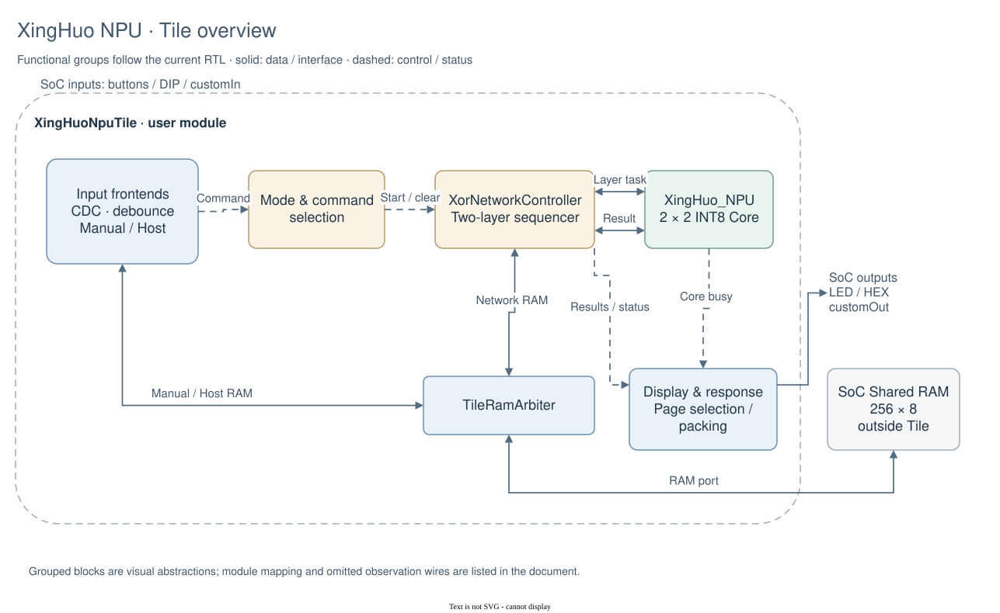

# “星火” NPU

面向 MPSoC-Digital 流片的教学型神经网络加速器。项目包含一个 2×2 INT8 Weight Stationary（权重固定）NPU Core，以及符合官方 Tile Contract（Tile 接口契约）的外围控制逻辑，可自动执行一个两层 XOR 分类网络。

## 当前能力

| 指标 | 当前设计 |
| :-- | :-- |
| 运算数据类型 | INT8 乘法、INT32 累加与 Bias（偏置） |
| 核心阵列 | 2×2 Systolic Array（脉动阵列） |
| Dataflow（数据流） | Weight Stationary（权重固定） |
| 激活与量化 | ReLU；Arithmetic Right Shift（算术右移）后 INT8 Saturation（饱和） |
| 网络工作流 | 两层 2×2 XOR 分类网络，由硬件自动调度 |
| 输入方式 | Manual Mode（手动模式）与 External Host Mode（外部主机模式） |
| 流片接口 | MPSoC-Digital 固定 Tile 接口、256×8 Shared RAM（共享存储器） |
| 基准时钟 | 150 MHz（PPA 假设，最终以后端结果为准） |

## 工程结构

```text
rtl/core/       与具体流片平台无关的 NPU Core（Verilog-2005）
rtl/tile/       MPSoC-Digital Tile 外围与 XOR 网络控制器（SystemVerilog）
tests/rtl/      Tile 单元测试与官方 Harness（验证外壳）测试
verification/   Core/Tile 的 SVA（SystemVerilog Assertions）
sim/            Python Golden Model、向量生成器和 Core Verilator 驱动
filelists/      Core 与完整 Tile 的 RTL 文件清单
docs/           架构、接口、量化与验证说明
ppa/            Yosys + ICS55 + iEDA 的本地 PPA 估算流程
design.json     MPSoC-Digital 官方工程描述
```

最终提交给 MPSoC-Digital 的顶层 `Tile` 由官方导出工具生成。仓库中的用户顶层是 `XingHuoNpuTile`，其端口名称、方向和位宽严格遵循官方契约。Shared RAM 由 SoC 提供，设计只连接其单端口接口，不在 Tile 内重复实例化。



[查看 Core、阵列、PE、VPU 与 XOR 调度的分层架构图](docs/architecture.md)。
所有图片都有可在 draw.io 中拖动、编辑的[原生图源](docs/diagrams/README.md)。

## 两层 XOR 网络

硬件依次执行 `h = ReLU(A×W1+B1)` 和 `y = ReLU(h×W2+B2)`。固定 Demo 使用
`W1=[[1,-1],[-1,1]]`、`B1=[0,0]`、`W2=[[-1,1],[-1,1]]`、`B2=[1,0]`，
并比较两个输出得分类别。第二层输入来自第一层真实 RTL 输出，而非 Golden Model。

## 两种使用方式

### Manual Mode（手动模式）

复位后默认为手动模式。DIP Switch（拨码开关）表示一个 8-bit 数据或地址：

| 按钮 | 功能 |
| :-- | :-- |
| BTN0 | 将 DIP 写入当前 RAM 地址，然后地址加一 |
| BTN1 | RAM 地址归零 |
| BTN2 | 将 DIP 装入 RAM 地址指针 |
| BTN3 | 使用 RAM 中参数运行可编程两层网络 |
| BTN4 / BTN5 | 下一个 / 上一个显示页面 |
| BTN6 | 清除完成与错误状态 |
| BTN7 | 用 DIP[1:0] 运行固定参数 XOR Demo（演示） |

BTN7 是最简单的上板路径：用 DIP[1:0] 输入 `00/01/10/11`，按一次 BTN7，LED 即可显示分类结果。按钮经过同步、Debounce（去抖）和单脉冲处理。

### External Host Mode（外部主机模式）

将 `io_customIn[15]` 置 1 请求外部模式。主机通过 Toggle Handshake（翻转握手）访问 RAM、启动任务和读取结果：

```text
io_customIn[7:0]   payload
io_customIn[8]     request toggle
io_customIn[11:9]  opcode
io_customIn[15]    external-mode request
```

主机先稳定 payload/opcode/mode，再翻转 request，并保持这些信号，直到 `io_customOut[8]` 的 acknowledge toggle 与 request 相等。

| Opcode | 操作 |
| :-- | :-- |
| 0 | 设置 RAM 地址 |
| 1 | 写一个字节并自动递增地址 |
| 2 | 读一个字节并自动递增地址 |
| 3 | 启动 RAM 参数网络 |
| 4 | 用 payload[1:0] 启动固定 XOR Demo |
| 5 | 清除状态 |

`io_customOut[7:0]` 是读数据；`[9]` busy；`[10]` done；`[12]` error；`[13]` classification；`[14]` 当前模式；`[15]` 表示协议版本 1。完整 RAM Map（地址表）和显示页面见 [接口说明](docs/interfaces.md)。

## Shared RAM Map（共享存储器地址表）

| 地址 | 内容 |
| :-- | :-- |
| `00..03` | 输入 Activation（激活矩阵） |
| `10..1C` | 第一层 Weight、Bias、Shift |
| `20..23` | 第一层隐藏输出 |
| `30..3C` | 第二层 Weight、Bias、Shift |
| `40..43` | 第二层完整输出 |
| `44..46` | 分类、状态、错误码 |

所有多字节数据采用 Little Endian（小端）；逐字节定义见 [接口说明](docs/interfaces.md)。

## 验证

```bash
make test
```

它执行 Python Golden Model 单元测试、1016 组 Core 定向/随机向量、160组可编程两层网络、手动/外部协议边界、Core/Tile SVA和四态RTL测试。expected由Python Golden Model自动生成。

```bash
make doctor
make official-check
make official-export
```

项目根目录存在 `mpsoc-digital/` 时会自动使用该模板，也可通过 `MPSOC_DIGITAL=/path/to/mpsoc-digital` 覆盖。`official-export` 会在导出后运行 `export-check`。具体分层见 [验证说明](docs/verification.md)。

## PPA 估算

```bash
make ppa ICS55_PDK=~/pdk/icsprout55-pdk IEDA_BIN=/path/to/iEDA
make gls
make multi-corner
make release-check
```

该流程综合完整 `XingHuoNpuTile`。PPA 是前端估算，不等于布局布线后的签核结果，详见 [PPA 说明](ppa/README.md)。

最近一次已保存的结果仍是新版ICS55、200 MHz、完整探索性IO预算下的TT估算：6185个标准单元，面积
13032.32 μm²，Setup WNS 0.115 ns、Hold WNS 0.012 ns。功耗0.2447 W使用默认
活动率。部分慢角存在setup风险，部分快角存在hold风险，应查看
`build/ppa/XingHuoNpuTile-main-200MHz-RVT/corners/summary.md`。该组数据仅作为历史
基线，不代表当前150 MHz配置；重新执行`make ppa`后应以
`build/ppa/XingHuoNpuTile-main-150MHz-RVT/`中的报告为准。
最终状态、缺少的平台输入和交付包说明见[流片准备记录](docs/tapeout-readiness.md)。

## 实物连接边界与已知限制

- RTL 只定义数字 Tile 接口，不保证 `io_customIn/io_customOut`直接连接到封装引脚；
  引脚、电压、连接器和外部设备接法由最终 MPSoC-Digital 平台决定。
- 不假设平台包含 CPU，也不依赖 Shared RAM 的复位初值。
- 当前网络规模固定为两层 2×2，参数可编程，但尚无通用指令集或大容量片上存储。
- 按键去抖默认按 150 MHz 配置；若官方最终时钟不同，应调整
  `BUTTON_DEBOUNCE_CYCLES`。
- 当前尚未完成布局布线后 STA、功耗签核、DFT 或硅后验证。

## 文档与官方依据

- [架构说明](docs/architecture.md)
- [RTL 模块接口说明](docs/module-interfaces.md)
- [Tile RTL 学习导读：握手、仲裁、CDC 与状态机](docs/tile-rtl-study-guide.md)
- [NPU Core RTL 学习导读：FSM、valid 流水与定点数](docs/core-rtl-study-guide.md)
- [接口、RAM Map 与操作步骤](docs/interfaces.md)
- [INT8 量化规则](docs/quantization.md)
- [验证策略](docs/verification.md)
- [MPSoC-Digital](https://github.com/openecos-projects/mpsoc-digital)
- [Tile Contract](https://github.com/openecos-projects/mpsoc-digital/blob/main/docs/cn/tile-contract.md)
- [User Guide](https://github.com/openecos-projects/mpsoc-digital/blob/main/docs/cn/user-guide.md)
- [Architecture](https://github.com/openecos-projects/mpsoc-digital/blob/main/docs/cn/architecture.md)
