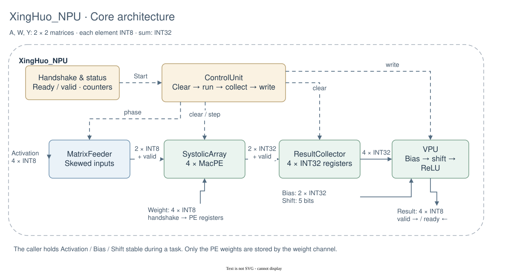
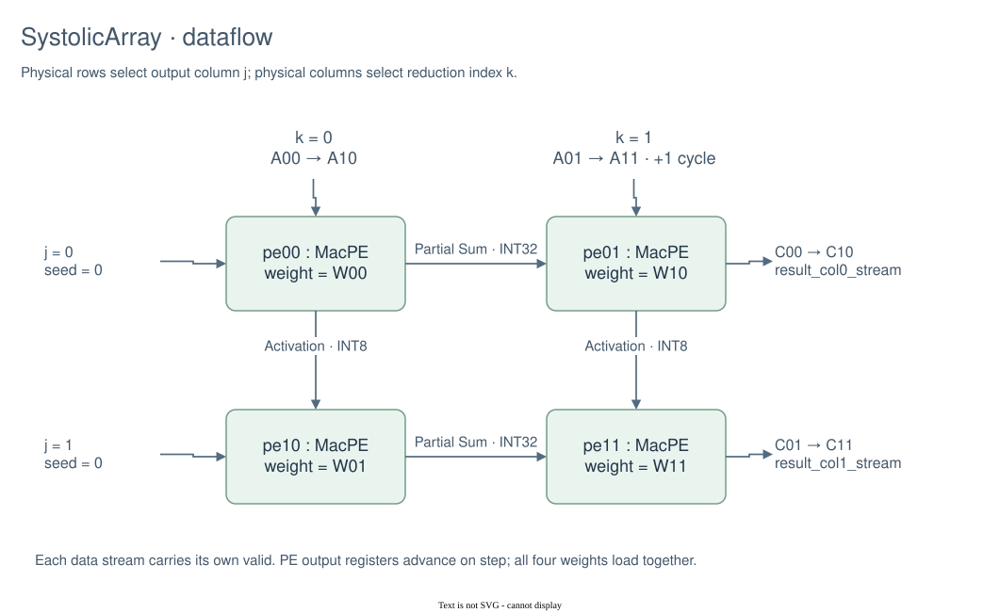
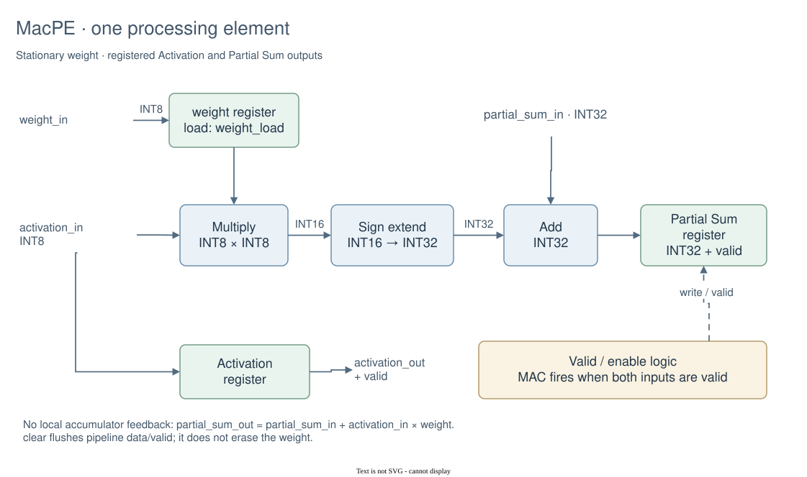
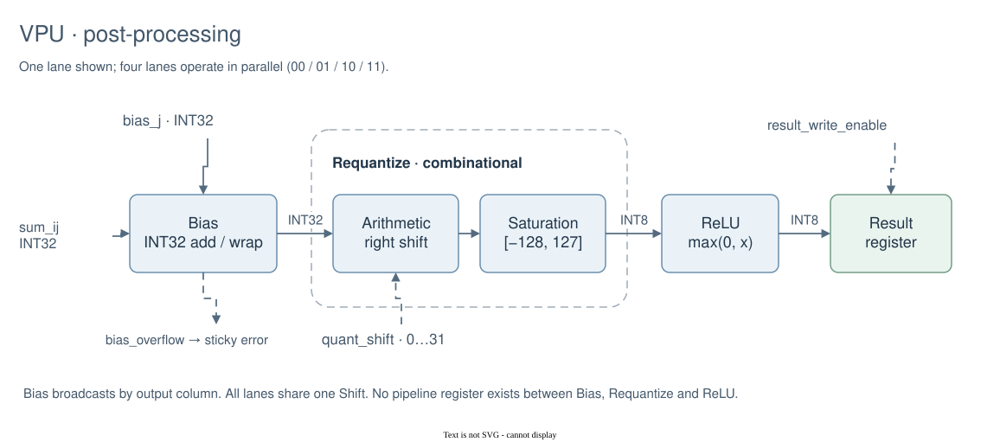
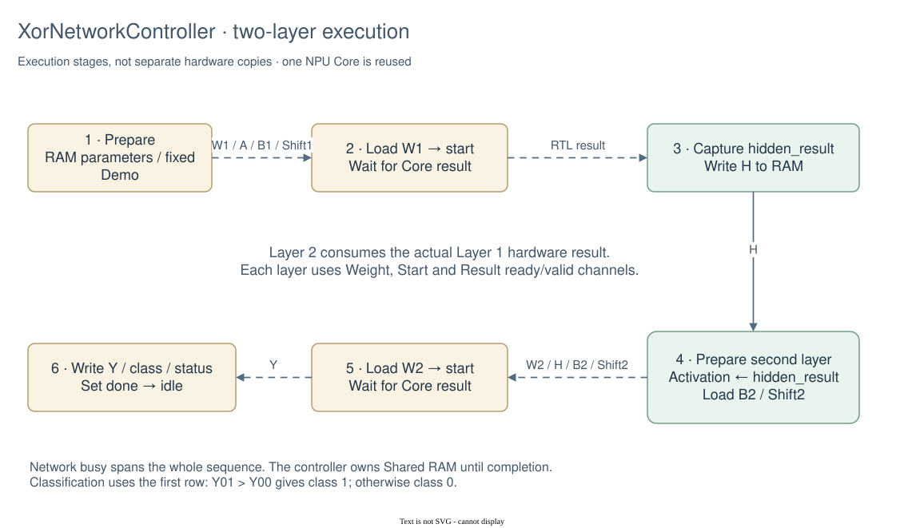

# 架构说明

设计分成可复用的 NPU Core 和 MPSoC-Digital Tile Adapter（Tile 适配层）。Core 不知道按钮、LED、外部命令和 Shared RAM；适配层负责把平台资源变成 Core 任务。

本文按 Tile → Core → 关键内部模块展开。图中蓝色表示接口或组合数据处理，绿色表示计算阵列或寄存器，浅黄色表示控制。实线表示数据或打包后的接口，虚线表示控制或状态；边界框使用虚线。图中 INT8/INT16/INT32 均表示有符号数，打包总线本身不一定声明为 signed。

图源和修改方法见 [diagrams/README.md](diagrams/README.md)。图中的功能分组只是绘图抽象，不代表新增 RTL 包装模块。

## 1. Tile 整体架构

从左向右看：输入前端生成命令，模式与命令选择逻辑选出启动请求，网络控制器调度 NPU Core。下方是 RAM 通路及显示输出。SoC Shared RAM 位于 Tile 外部；左上和右侧文字代表平台逻辑端口，不代表已经确定的封装引脚或板级连接。

| 图中分组 | 实际 RTL |
| :-- | :-- |
| Input frontends | `TileInputSynchronizer`、`ButtonConditioner`、`ManualInputController`、`ExternalHostInterface` |
| Mode & command selection | `TileModeController`、`TileCommandMux` |
| Display & response | `DisplayController`、`TileOutputAdapter` |

图中双向 Layer task/Result 连线表示包含反向 ready 的接口：任务和权重数据/valid 由控制器发往 Core，ready 由 Core 返回；结果数据/valid 由 Core 返回，result_ready 由控制器发出。RAM 双向线是读写接口的功能表达，RTL 中地址、写使能、写数据向 RAM 输出，读数据沿独立输入返回。

为减少交叉线，总图省略了模式使能与交接反馈、Host ACK/读数据到输出打包器、手动页面/地址及 RAM 读数据到显示器等观察连接。`TileRamArbiter`实际只选择 RAM 的地址和写通路；RAM 读数据直接连到 Host、网络控制器和显示器，并不在仲裁器中缓存。

`XorNetworkController`是两层网络 Sequencer（时序控制器）。它读取输入和第一层 Weight/Bias/Shift，通过ready-valid权重通道和任务通道驱动并列的`XingHuo_NPU`，再通过ready-valid结果通道收集Hidden Activation（隐藏层激活）；随后以隐藏层结果作为第二层输入并重复计算，最后写回输出、类别、状态和错误码。Core和控制器只通过显式命令、数据和响应信号连接。

## 2. NPU Core

主数据通路是 `MatrixFeeder → SystolicArray → ResultCollector → VPU`。上方的
`CoreController`集中处理外部握手、权重/结果状态、粘滞错误和性能计数，并在
内部实例化`ComputeSequencer`；后者负责清空流水、推进四个phase、等待收集并使能
结果写入。`XingHuo_NPU`顶层本身只声明模块间连线并实例化这些功能模块，不再
包含组合译码或时序寄存器。

每个 PE 只有一个当前权重寄存器；权重握手会原子更新完整 2×2 权重矩阵，忙时 `weight_ready=0`。Activation、Bias 和 Shift 没有在 Core 入口另存一份，调用者在任务期间保持它们稳定。结果由 VPU 寄存器保存，`result_valid`保持到下游握手，等待期间 Core 仍为 busy。

## 3. Systolic Array（脉动阵列）

Activation（激活值）**从上向下**传播，INT32 Partial Sum（部分和）**从左向右**传播。物理行对应输出列 j，物理列对应归约索引 k，所以第一行 PE 保存 `W00、W10`，第二行保存 `W01、W11`。这与按矩阵元素名称直接排列 `W00、W01 / W10、W11` 不同。

`MatrixFeeder`依次送入：phase 0 为 `(A00, 无效)`，phase 1 为 `(A10, A01)`，phase 2 为 `(无效, A11)`，phase 3 两路均无效并排空流水。第二个 k 列晚一拍注入，使激活与左侧部分和对齐。图中数据名称之间的箭头表示时间顺序。

右边界的 `result_col0_stream`先输出 C00、再输出 C10；`result_col1_stream`先输出 C01、再输出 C11。`ResultCollector`为每个流独立保存一个接收索引，并按 valid 写入四个 INT32 结果寄存器。输入/权重/最终 INT8 结果的打包顺序均是低字节到高字节 `00、01、10、11`。

## 4. MacPE（处理单元）

组合乘法产生 INT16，显式符号扩展到 INT32 后与 `partial_sum_in`相加，再写入输出寄存器。这里没有本地累加反馈环：每拍使用的是左侧传来的部分和，而不是自己的上一拍 `partial_sum_out`。

`enable && activation_valid_in && partial_sum_valid_in`时写入有效 MAC 结果；Activation 数据和 valid 在 enable 时向下一级推进。`clear`清空流水数据/valid，但不清除驻留权重；权重只在复位或 `weight_load`时更新。图中的绿色方框标出寄存器边界，省略了复位及部分 valid 连线。

## 5. VPU（后处理单元）

图中展示一个通道，实际有 00、01、10、11 四路并行的 `Bias → Requantize → ReLU`。Bias 按输出列广播，两行的第 0 列使用 bias0，第 1 列使用 bias1；四路共享一个 5-bit Shift。

Bias 加法按 INT32 回绕并报告溢出；Requantize 直接算术右移并饱和到 INT8；ReLU 将负值置零。图中处理步骤之间没有流水寄存器，只有最后的结果寄存器。`result_write_enable`同时锁存四个 INT8 结果，四路 Bias 溢出合并上报给 Core。

## 6. 两层 XOR 自动调度

这张图展示执行阶段，不代表六份硬件。控制器复用同一个 Core：准备第一层数据、权重握手、任务握手、等待结果，然后保存隐藏层并写入 RAM。在隐藏层最后一个字节写回的同一拍，将 `hidden_result`装入下一层 `activation_matrix`；第二层不从 Golden Model 取值，也不需要从 RAM 重新读回 H。

准备第二层参数后再次装权重并计算，最终比较第一行的两个得分 `Y01 > Y00`，成立为类别 1，否则为 0（包括相等）。完整四字节结果和类别/状态/错误写回后，控制器置 done 并回到 idle。可编程模式从 RAM 取参数；固定 Demo 从 RTL 常量取参数，但共用调度器和 Core。

## 平台时序边界

Shared RAM 是平台资源：256×8、异步读、时钟上升沿写。网络运行期间 Sequencer 独占 RAM；空闲时 RAM 交给当前输入模式。模式交接需要网络空闲且没有待消费的写入、启动或清除事件；模式请求变化时先禁止接收旧模式的新命令。

Tile 与 Core 状态均在 `clock` 上升沿使用同步高有效 `reset`。按钮、DIP 和 `io_customIn`在消费前经过两级 Synchronizer（同步器）；多位外部命令采用“先稳定数据、再翻转请求、保持到应答”的约束。
